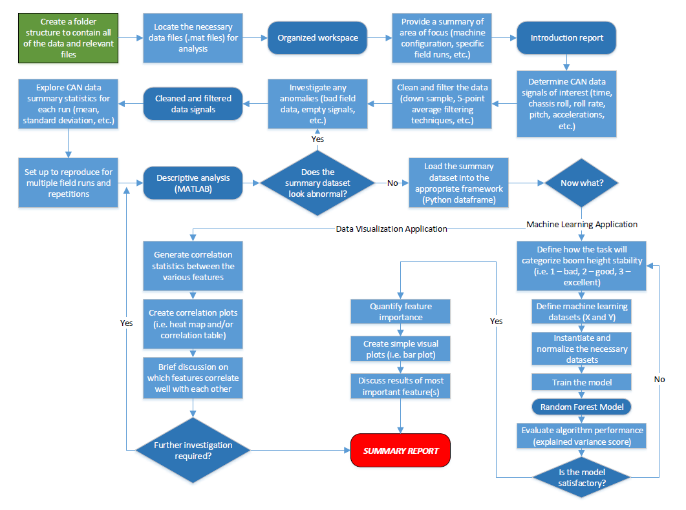
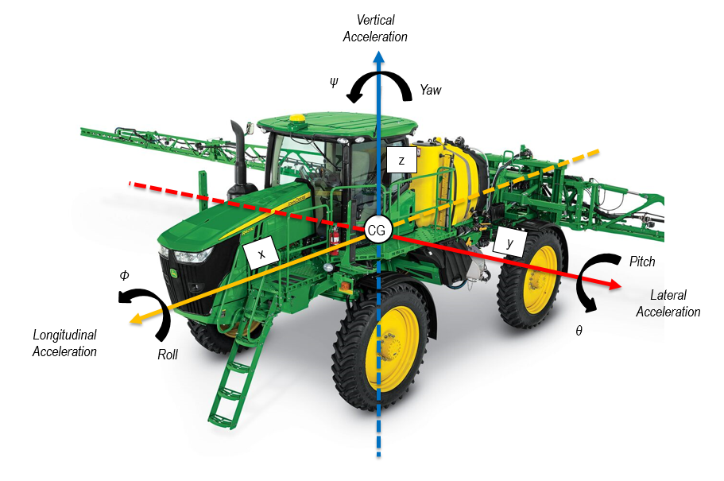
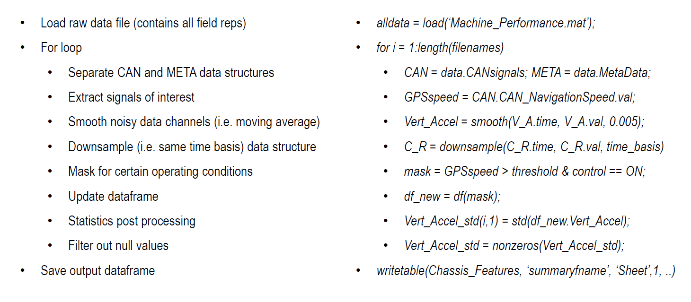
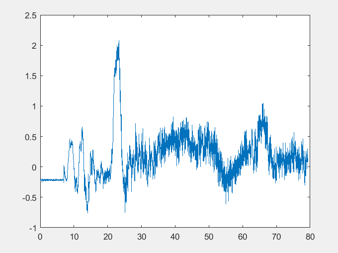
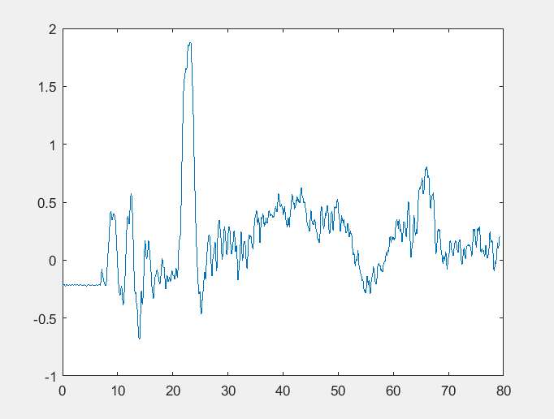
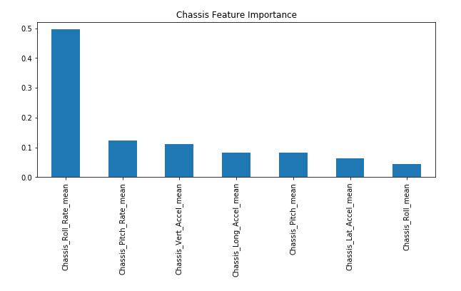

[Python Notebook](https://nbviewer.jupyter.org/github/badams97/Sprayer_Chassis_Features/blob/master/ABE%20516%20Project%20-%20Bailey%20Adams.ipynb)

### Introduction

**_Purpose_**: _this website provides an overview of evaluating chassis suspension feature importance when classifying boom height performance of self-propelled sprayers_.

With agricultural machines becoming more and more intelligent over the past decade, a huge focus shift has been progressing on ensuring that these machines deliver their maximum potential.  Specifically for self-propelled sprayers, advancements in spraying technology has led to the need for further improved boom height control.  Not only does boom height control help provide targeted positioning above the plant of interest, it also allows for consistent spray patterns and more equal chemical coverage overall.  Without the proper establishment of effective boom height control strategies, problems such as spray drift and crop damage are intensified.

In regards to the complete structure of a self-propelled sprayer, the chassis suspension system is a fundamental element driving the comprehensive performance of boom height control.  In an ideal environment, the sprayer boom would be entirely decoupled from the chassis, which would be isolated from any chassis inputs in return.  However, in reality, this is an impossible design requirement.  A completely decoupled architecture would result in systematic failure to maintain boom height leveling on uneven terrain and would greatly affect control system error anytime the machine is under motion.  Furthermore, current chassis and suspension designs possess a significant demand on operator ride quality.  The preferences towards ride comfort, safety, and inherent chassis roll stability frequently contributes towards non-optimized boom height control situations.

**_Goal_**: _this project intends to analyze the interactions of the chassis on overall boom height stability.  By determining the most important chassis performance features when classifying boom height performance, the highest ranked parameters can be prioritized for future product development work_.  

***

### Project Workflow

Displayed below, this detailed project workflow accurately describes the overall process for this project.  The main steps in this procedure include the following:

1. Organized workspace
2. Introduction report
3. Specify features to analyze
4. Filter the appropriate data signals
5. Descriptive analysis
6. Data exploration and visualization
7. Machine learning application
8. Feature importance output
9. Summary report



***

### Selected Chassis Features



### Data Preparation

..*MATLAB 
..*Python



Original Acceleration Signal             |  Acceleration Signal Post-Filtering
:-------------------------:|:-------------------------:
  |  

***

### Data Exploration

Demonstrate what you would do to describe the data and if it has any patterns or anomolies.  Make some plots.

***

### Random Forest Model

Build a model, fit the model, validate the model.

```yml
title: [The title of your site]
description: [A short description of your site's purpose]
```

***

### Feature Importance



What did you learn and do the results make sense?  Revisit your initial question and answer it.

***

### Class Exercise

In each project, I'd like to see a homework assignment that the class can do/evaluate to learn more about your data.  This should be a reproducible notebook that allows them to learn one or more aspects of your data workflow.  It is also an opportunity to share your research with your colleagues.

Here is an example of a fantastic project website:

https://stephenslab.github.io/ipynb-website/
