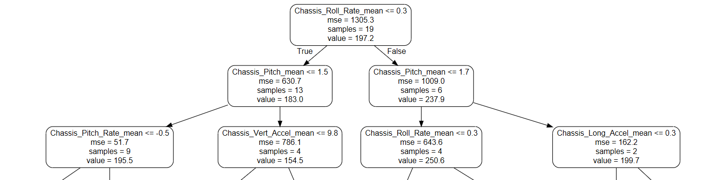

### Introduction

**_Purpose_**: _this website provides an overview of evaluating **chassis suspension feature importance** when classifying boom height performance of self-propelled sprayers_.

With agricultural machines becoming more and more intelligent over the past decade, a huge focus shift has been progressing on ensuring that these machines deliver their maximum potential.  Specifically for self-propelled sprayers, advancements in spraying technology has led to the need for further **improved boom height control**.  Not only does boom height control help provide targeted positioning above the plant of interest, it also allows for **consistent spray patterns** and more equal chemical coverage overall.  Without the proper establishment of effective boom height control strategies, problems such as **spray drift and crop damage** are intensified.

In regards to the complete structure of a self-propelled sprayer, the **chassis suspension system** is a fundamental element driving the comprehensive performance of boom height control.  In an ideal environment, the sprayer boom would be entirely decoupled from the chassis, which would be isolated from any **chassis inputs** in return.  However, in reality, this is an impossible design requirement.  A completely decoupled architecture would result in systematic failure to maintain boom height leveling on uneven terrain and would greatly affect control system error anytime the machine is under motion.  Furthermore, current chassis and suspension designs possess a significant demand on operator ride quality.  The preferences towards ride comfort, safety, and inherent chassis roll stability frequently contributes towards **non-optimized boom height control situations**.

**_Goal_**: _this project intends to analyze the interactions of the chassis on overall boom height stability.  By quantifying the most important **chassis performance features** when classifying **boom height performance**, the highest ranked chassis parameters can be prioritized for future product development work_.  

***
***

### Workflow

Displayed below, this detailed project workflow accurately describes the **overall process** for this investigation.  The main steps in this procedure include the following:

1. Organized Folder Structure
2. Selection of Features to Analyze
3.  Extract and Filter Necessary Data Signals
4.  Descriptive Analysis
5.  Data Exploration and Visualization
6.  Machine Learning Application
7.  Feature Importance Quantification
8.  Summary Report


***
***

### Self-Propelled Sprayer Dynamics

#### Chassis Suspension System

Attributes of chassis dynamics are distinguished according to the **principal axes** of the chassis suspension system of a self-propelled sprayer.  These features are outlined in the table below, and the **bolded attributes** represent the selected features for this study.

| Axis | Rotation | Rotation Rate  |  Acceleration   |
| ------------- |:-------------:| -----:| -----:|
| X | **Roll**  | **Roll Rate** | **Longitudinal**  |
| Y | **Pitch** | **Pitch Rate** |  **Lateral**  |
| Z | Yaw   | Yaw Rate |  **Vertical**  |


#### Boom System

In terms of the boom system, a common **key performance indicator** (KPI) for measuring boom height performance is the **standard deviation of boom elevation**, which is measured in reference to the ground.  Because there is generally a left and right boom on a self-propelled sprayer, these standard deviations are averaged to provide **one single metric**.  Therefore, this standard deviation KPI will serve as the classifier in the machine learning algorithm. 

***
***

### Data Analysis Overview

Overall, the complete data anlaysis for this investigation was performed in two individual platforms: **MATLAB and Python**.  In general, MATLAB was utilized more for **data organizing and processing**, where Python was applied for its **machine learning capabilities** when classifying boom height performance.

All of the initial data channels are based on timeseries data extracted from previous machine testing out in the field.  The **same machine configuration** was used to collect **CAN-based data** across a plethora of different field passes for natural variation.  In order to negate the influence of time, **descriptive analysis** (i.e. mean, standard deviation, etc.) of each data signal was implemeted to provide a complete summary of each field pass.

A brief outline of the data analysis steps performed in MATLAB is provided below:  


Here's a link to the **Python notebook** which hosted the analysis for chassis feature correlation and the machine learning application: [notebook](https://nbviewer.jupyter.org/github/badams97/Sprayer_Chassis_Features/blob/master/ABE%20516%20Project%20-%20Bailey%20Adams.ipynb).

***
***

### Data Exploration

The initial data investigation revealed that a total of **42 field passes** were included in this investigation.  Additionally, it also disclosed that **chassis lateral acceleration and chassis roll** along with **chassis longitudinal acceleration and chassis pitch** are highly correlated with each other, as indicated by the lighter colors.


***
***

### Random Forest Model

In machine learning applications, a random forest is defined as a "meta estimator that fits a number of classifying **decision trees** on various sub-samples of the dataset and uses averaging to improve the predictive accuracy and control over-fitting." 

In other terms, "random forest, like its name implies, consists of a large number of individual decision trees that operate as an **ensemble**. Each individual tree in the random forest spits out a class prediction and the class with the **most votes** becomes the model’s prediction."

The random forest classifier was chosen for this analysis due to its ability to extract **feature importance**.  By quantifying which chassis suspension features are the most important when classifying boom height performance, the product development process can prioritize chassis designs that focus on these highest ranked features.

The various properties of this specific random forest application are described below:

```yml
train_size: 75% of the data was used for training the model
n_estimators: 1000 estimators were used which means that there are
    1000 trees in the in the forest
random_state: Set to 0 to ensure the same results every time
explained_variance_score: ~ 47% of this model accounts for the variation
    in the dataset
max_error: the maximum residual error was calculated to be ~ 99
```

Additional **documentation and information** on this random forest classifier algorithm can be found on these two websites: [random forest - sklearn](https://scikit-learn.org/stable/modules/generated/sklearn.ensemble.RandomForestRegressor.html) and [understanding random forest](https://towardsdatascience.com/understanding-random-forest-58381e0602d2).

***
***

### Feature Importance

As depicted in the following image, the random forest algorithm generated a corresponding decision tree to base the classification on.  The root node for this tree contains the **chassis roll rate** parameter, and, therefore, this attribute is considered as the most important feature.



Furthermore, a **feature importance plot** was created to understand the importance distribution among the various chassis features.  It is shown that chassis roll rate accounts for approximately **49.6%** of the overall importance, whereas chassis pitch rate and chassis vertical acceleration only account for **12.4% and 11.0%**, respectively. 


**_Conclusion_**: with chassis roll rate maintaining a significant portion of the overall importance, this feature can now uphold the highest priority when evaluating future chassis systems.  By focusing on **reducing the average chassis roll rate** experienced throughout the field, the **greatest impact** should be seen in reducing the standard deviation of boom motion.  Therefore, this should produce a more stable boom and improved boom height performance.

***
***

### Class Exercise

...
